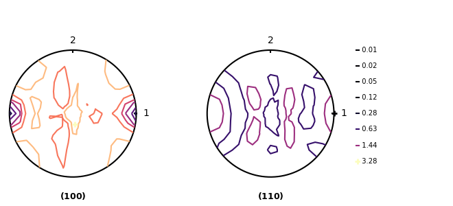
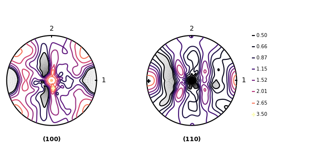

# How to Draw Pole figure

## 0. What is pole figure?
A Pole figure is tools to visualize crystallographic textures of crystalline materials. It shows the angle and distribution that a particular crystallographic direction (or plane) makes with the surface of the material. It is mainly utilized in tissue analysis of metals, ceramics, or polycrystalline materials.

.gif)<br>
*(110) Pole figure of cubic*

.gif)<br>
*(100) Pole figure of cubic*


## 1. Basic Preparation
Install [`texture3`](https://github.com/youngung/texture3) from github using clone or download
```shell
$ pip install .
```
Execute [```setup.py```](setup.py) in folder `texture3`

## 2. Run command
```shell
$ ipython --pylab
```
Enter python in cmd
```python
from TX import upf
```
Load ```upf``` from module ```TX```
```python
mypf = upf.polefigure(fnsx='fnsx file name', filename='TEX_PH1.OUT')
```


Save data in `mypf`,
Use [`fnsx`](README/F_voce.sx) file used in evpsc simulation and [`TEX_PH1.OUT`](README/TEX_PH1_5000.OUT) created after the simulation as Arguments

### class polefigure:
| Arguments                                       |    Description                                | Default value |
|:------------------------------------------------|:----------------------------------------------|:--------------|
| `grains` or `filename`                          | Grains data or name of file              | None          |
| `fnsx`                                          | Single crystal file used in VPSC-family codes | None          |
| if not have `fnsx`, use `csym`, `cdim`, `cang`  |                                               |               |  
| `csym`                                          | Crystal symmetry  ex. 'cubic' or'hexag'       |               |
| `cdim`                                          | Lattice constants                             | [1.,1.,1.]    |
| `cang`                                          | Lattice angles                                | [90.,90.,90.] | 
| `ssym`                                          | Sample symmetry: not even started...          | False         |  
| `ngarin`                                        | Number of grains                              | 100           | 
| `epf`                                           | experimental pole figure file                 | None          | 
| `epf_mode`                                      | epf file mode, 'epf' or 'xpc'                 |               |
*If you want more detail of arguments, refer to [`upf.py`](src/upf.py#L1291)*
```
$ mypf.pf_new(poles=[[1,0,0],[1,1,0]],mn=0.5,mx=3.5,ismooth=10)
```
```pf_new``` do Draw Polefigure
### pf_new
| Arguments      |    Description                                                    | Default value   |
|:---------------|:------------------------------------------------------------------|:----------------|
| `ifig`         | figure index(ifig and axs cannot be used at the same time.)       | None            |
| `axs`          | Arranging an axis or subplot in a graph or plot                   | None            |
| `proj`         | proj can be either 'pf' or 'ipf'                                  | 'pf'            |
| `poles`        | Miller index of Polefigure                                        |[[1,0,0],[1,1,0]]|
| `ix`, `iy`     | x and y tick labels appended to each pole figure                  | ix='1',iy='2'   | 
| `dph`          | Grid of tilting angle                                             | 10              |
| `dth`          | Grid of in-plane rotation angle                                   | 10              |
| `rot`          | in-plane rotatation (radian)                                      |                 |
| `n_rim`        | The number of 'central' rims to be *averaged*                     | 2               |
| `cdim`         | crystal dimension                                                 | None            |
| `ires`         | If True, indicate the grid                                        | True            |
| `mn`           | Minimun level of contour                                          | None            |
| `mx`           | Maximun level of contour                                          | None            |
| `lev_norm_log` | If True, use logarithmic scales. If False, linear scale.          | True            |
| `nlev`         | Level of iso contour bins                                         | 7               |
| `cmap`         | Color map used to color-code the contour levels                   |                 |
| `iline_khi80`  | Whether or not to draw a line of chi=80                           |                 |
| `mode`         | ex. Contour modes, dot modes                                      | 'line'          |
| `ilev`         | Level options to apply to the pole (0 or 1)                       | 1               |
| `levels`       | Default is None. One can define levels of the contours            | None            |
| `transform`    | transformation matrix applied to the entire polycrystal aggregate | 'magma'         |
| `ideco_lev`    | switch to turn on or off the levels                               | True            |
| `ismooth`      | Contours become smooth                                            | 1               |
*If you want more detail of arguments, refer to [`upf.py`](src/upf.py#L1872)*

<br>
*Use arument poles only*

<br>
*Use additional arguments mn, mx, ismooth*


# Pole figure 그리기

## 0. Pole figure란?
폴 피규어는 결정질 물질의 결정학적 질감을 시각화하는 도구입니다. 특정 결정학적 방향(또는 평면)이 물질 표면과 이루는 각도와 분포를 보여줍니다. 주로 금속, 세라믹 또는 다결정 물질의 조직 분석에 사용됩니다.

.gif)<br>
*(110) Pole figure of cubic*

.gif)<br>
*(100) Pole figure of cubic*

## 1. 기본 준비
 git hub로부터 texture3를 clone 혹은 download를 통해 설치
```shell
$ pip install .
```
texture3 폴더내의 ```setup.py```실행
## 2. 명령어 실행
```shell
$ ipython --pylab
```
cmd 창에서 파이썬실행
```python
from TX import upf
```
module ```TX```에서 ```upf```불러오기
```python
mypf = upf.polefigure(fnsx='fnsx file name', filename='TEX_PH1.OUT')
```
```mypf```에 데이터 저장, evpsc 시뮬레이션에 사용한 ```fnsx```파일, 시뮬레이션 이후  생성된 ```TEX_PH1.OUT```를 Arguments로 사용

### class polefigure:
| 인자                                            |   설명                                 | 기본값        |
|:------------------------------------------------|:--------------------------------------|:--------------|
| `grains` 또는 `filename`                        | 결정립 데이터 또는 파일의 이름           | None          |
| `fnsx`                                          | VPSC 계열 코드에서 사용되는 단결정 파일  | None          |
| `fnsx`이 없는 경우 `csym`, `cdim`, `cang`를 사용 |                                        |               |  
| `csym`                                          | 결정 대칭성, 예시. '입방정' 또는 '육방정'|               |
| `cdim`                                          | 격자 상수                              | [1.,1.,1.]    |
| `cang`                                          | 격자 각도                              | [90.,90.,90.] | 
| `ssym`                                          | 샘플 대칭성: 현재 구현되지 않음...       | False         |  
| `ngarin`                                        | 결정립 수                              | 100           | 
| `epf`                                           | 실험 데이터를 포함하는 극점도 파일       | None          | 
| `epf_mode`                                      | 극점도 파일 모드, 'epf' 또는 'xpc'      |               |
*인자들에 관하여 더 자세한 정보를 원하면 [`upf.py`](src/upf.py#L1291)을 참고*

```python
mypf.pf_new(poles=[[1,0,0],[1,1,0]],mn=0.5,mx=3.5,ismooth=10)
```
polefigure 생성
```pf_new```

### pf_new
| 인자           |   설명                                                              | 기본값          |
|:---------------|:-------------------------------------------------------------------|:----------------|
| `ifig`         | figure index(ifig와 axs를 동시에 사용할 수 없음)                     | None            |
| `axs`          | graph나 plot에서 축 또는 부분 plot 배열하기                          | None            |
| `proj`         | proj는 'pf' 또는 'ipf'일 수 있음                                    | 'pf'            |
| `poles`        | pole figure의 miller index                                         |[[1,0,0],[1,1,0]]|
| `ix`, `iy`     | 각 극점도에 추가되는 x 및 y 눈금                                     | ix='1',iy='2'   | 
| `dph`          | 틸팅 각도 격자                                                      | 10              |
| `dth`          | 평면 내 회전 각도 격자                                               | 10              |
| `rot`          | 평면 내 회전 (radian)                                               |                 |
| `n_rim`        | *평균*화할 '중심' 가장자리의 수                                      | 2               |
| `cdim`         | 격자 상수                                                           | None            |
| `ires`         | True라면, grid 표시.                                                | True            |
| `mn`           | 등고선의 최소 level                                                 | None            |
| `mx`           | 등고선의 최대 level                                                 | None            |
| `lev_norm_log` | True라면, log scale 사용. False라면, linear scale 사용.             | True            |
| `nlev`         | 등위 등고선 값값의 정도                                             | 7               |
| `cmap`         | 윤곽선 level에 색을 넣는 맵                                         |                 |
| `iline_khi80`  | chi=80의 선을 그릴지 여부                                           |                 |
| `mode`         | ex. Contour modes, dot modes                                      | 'line'          |
| `ilev`         | 극에 적용할 레벨 옵션(0 or 1)                                       | 1               |
| `levels`       | 기본값 X. 윤곽선의 레벨을 정의                                      | None            |
| `transform`    | 다결정 집합체에 적용된 변환 행렬                                    | 'magma'         |
| `ideco_lev`    | level을 켜거나 끄는 switch                                         | True            |
| `ismooth`      | 등고선이 부드러워짐                                                | 1               |
*인자들에 관하여 더 자세한 정보를 원하면 [`upf.py`](src/upf.py#L1872)을 참고*
<br>
*poles arument만 사용*

<br>
*mn, mx, ismooth arguments를 추가로 사용*
